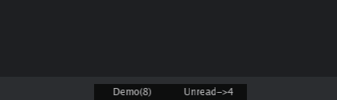
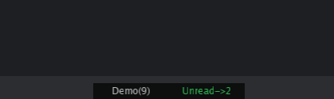
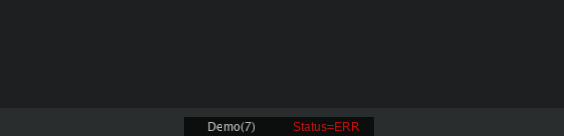

# windicators
Simple GUI indicators for desktop (discrete, no blinking).  
Hidden until one of the indicators are valid for display.  
Use your own _jobs_: API calls, bash scripts etc. for component data source.

_Tested on Ubuntu and MacOS (intel and apple silicon)_.

#### Dependencies
This package requires some OS dependencies because of some C bindings.

Ubuntu:
```
sudo apt install libgl1-mesa-dev xorg-dev
```

MacOS:
```
xcode-select --install
```

#### Example
```go
func main() {
    // Define window size and position
    iw, err := windicators.NewIndicatorWindow(200, 20, windicators.PositionCenterBottom)
    if err != nil {
        log.Fatalf("new window error: %s", err)
    }
    
    defer iw.Terminate()
    
    // First indicator component 
    windicators.NewComponent(iw, "demo-rand", "Demo(%v)", func (c *windicators.Component) any {
        r := rand.Intn(10) // simulate some background job/api call
        c.IsVisible = r > 3 // when to show
        return r            // return value
    }, 2*time.Second)
    	
    // Second indicator component 
    windicators.NewComponent(iw, "demo-dummy-emails", "Unread->%v", func (c *windicators.Component) any {
        unreadCount := myFuncFetchEmails()
        c.IsVisible = unreadCount > 0
        return unreadCount
    }, 5*time.Second)
    
    // Ready!
    iw.Run()
}

// This is dummy function just to demonstrate something is done 
func myFuncFetchEmails() int {
	 return rand.Intn(5)
}
```


Full demo can be found in example directory.

#### Text colors
```go
	c := windicators.NewComponent(iw, "demo-dummy-emails", "Unread->%v", func(c *windicators.Component) any {
		unreadCount := myFuncFetchEmails()
		c.IsVisible = unreadCount > 0
		return unreadCount
	}, 5*time.Second)

	c.Font.SetColor(.2, 1.0, .4, 1)
	c.OnClick = func(c *windicators.Component) {
		log.Printf("[%s] Click callback...", c.ID)
	}

```


## Use `glfw.Window` and customize as you will
```go
// IndicatorWindow for indicators
type IndicatorWindow struct {
	*glfw.Window
	// ...
```

## Example to dynamically change colors
```go
	windicators.NewComponent(iw, "demo-rand-status", "Status=%v", func(c *windicators.Component) any {
		// simulate some background job/api call
		r := rand.Intn(5)

		status := ""
		switch r {
		case 1:
			status = "OK"
			c.Font.SetColor(0, 1, 0, 1)
		case 3:
			status = "ERR"
			c.Font.SetColor(1, 0, 0, 1)
		default:
			c.Font.SetColor(1, 1, 1, .5)
		}

		c.IsVisible = status != "" // when to show
		return status              // return value
	}, 2*time.Second)
```


### Predefined positions and offset
First use one of these: `PositionCenterTop`, `PositionRightTop`, `PositionRightCenter`, `PositionRightBottom`, `PositionCenterBottom`, `PositionLeftBottom`, `PositionLeftCenter`, `PositionLeftTop`.  
Then fine tune with `iw.MoveTo(x,y)`:
```go
    iw.MoveTo(iw.Position.X - 100, iw.Position.Y + 60)
```

### Click callback
Assign component `OnClick` callback to do something special.
```go
wi.NewComponent(iw, "demo-rand", "Demo(%v)", func(c *wi.Component) any {
    // simulate some background job/api call
    r := rand.Int31n(10)
    c.IsVisible = r > 0 // when to show
    c.Data = fmt.Sprintf("http://localhost?mydata=%d",r)
    return r            // return value
}, 15*time.Minute)

c.OnClick = func(c *windicators.Component) {
	log.Printf("[%s] Click", c.ID)
	log.Printf("Open URL `%s`", c.Data.(string)) // --> http://localhost?mydata=2
}

```

### TODO's
- [ ] Test/Fix for other OS's
- [ ] Window auto resize for indicators visible
- [ ] Vertical display
- [ ] Add real-life examples under `examples/` folder
- [ ] Before/After render hooks
- [ ] Loading and Minimized views
- [ ] Be aware of multiple monitors
